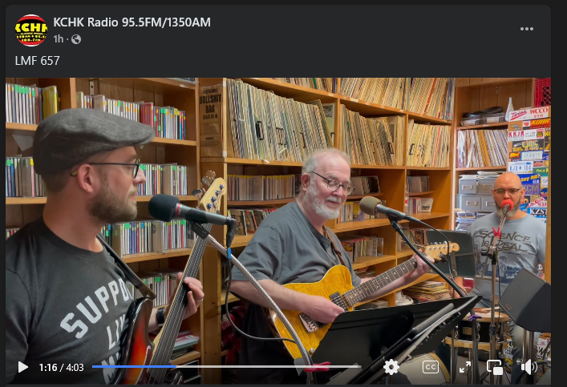

### The Donner Party
## Classic country you can sink your teeth into


You can listen to our recent performance on KCHK radio 95.5 New Prague [](https://www.facebook.com/share/v/1EHFwNXLmd/)
## Our first album is ready! Click the audio below to hear our newest songs.


https://github.com/user-attachments/assets/29e6658f-3a51-4ed1-9c7c-6fc00cedd62b


https://github.com/user-attachments/assets/21e47023-f525-45ec-a520-1eef933334bc


https://github.com/user-attachments/assets/96a10d14-6940-4c4a-81ba-d1930df3d988


https://github.com/user-attachments/assets/41e7a0ec-a4a8-49ca-b025-97a11373efb5


https://github.com/user-attachments/assets/653f58bc-e1d7-4ab1-8e0f-9a508cae994f


https://github.com/user-attachments/assets/34b4c678-ba4b-488b-8f6e-c88763bee730


https://github.com/user-attachments/assets/05978c78-d8de-4560-8c8d-40f0b93321ab


## Here's our schedule for 2025

<!--## [Whit Wort Brewing](https://www.whitwortbrewing.com/) 8-10 pm on Friday, February 23, 2024.

## [Paddlefish Brewing Co.](https://www.paddlefishbrewing.com/) 1-4 on on Sunday, April 21, 2024.

## [Westwood Marina](https://www.westwoodmarina.com/)  6-9 pm on Saturday, May 18, 2024.

## [Patrick's on Third](https://patricksfood.com/) 4-7 pm on Sunday, July 7, 2024.

## [Waseca County Free Fair](https://www.wasecacountyfreefair.com/). 1:30-3:30 pm on Friday, July 12, 2024.

##[Henderson Classic Car Roll-In](https://www.hendersonrollin.com/). 5:00-8:00 pm on Tuesday, July 30, 2024.

## [Paddlefish Brewing Co.](https://www.paddlefishbrewing.com/) 6-9 pm on on Friday, August 9, 2024.

## [The Flame](https://www.facebook.com/theflamebarandgrill/) 6-9 pm on Friday, October 18, 2024.

## [Patrick's on Third](https://patricksfood.com/) 4-7 pm on Sunday, October 27, 2024. 

## [The Flame](https://www.facebook.com/theflamebarandgrill/) 6-9 pm on Friday, February 21, 2025

## [Patrick's on Third](https://patricksfood.com/) 4-7 pm on Sunday, March 9, 2025.

## [Resistance Art Festival](https://www.mobilize.us/stpetermankato/event/785256/?referring_vol=2516134&share_context=dashboard-event-details&sharer_role=2) 11:00 am - 1:00 pm on Saturday, June 28, 2025.-->

## [Waseca County Free Fair](https://www.wasecacountyfreefair.com/). 1:30-3:30 pm on Friday, July 11, 2025.

## [Patrick's on Third](https://patricksfood.com/) 4-7 pm on Sunday, August 10, 2025. 

## [Westwood Marina](https://www.westwoodmarina.com/)  4-7 pm on Monday, September 1, 2025.


=======
## See all upcoming events at [The Donner Party](https://www.facebook.com/thedonnerpartyrocks) Facebook page.

### If you missed the livestream, you can still see [The Donner Party Christmas Party Party!](https://www.youtube.com/watch?v=iRwR2ySIA-g&t=1s)


# Contact us at <thedonnerpartyrocks@gmail.com>
# Logo by [Abby Daleki](www.abbydaleki.com)
<!--
## Welcome to GitHub Pages

You can use the [editor on GitHub](https://github.com/thedonnerpartyrocks/thedonnerpartyrocks.github.io/edit/master/README.md) to maintain and preview the content for your website in Markdown files.

Whenever you commit to this repository, GitHub Pages will run [Jekyll](https://jekyllrb.com/) to rebuild the pages in your site, from the content in your Markdown files.

### Markdown

Markdown is a lightweight and easy-to-use syntax for styling your writing. It includes conventions for

```markdown
Syntax highlighted code block

# Header 1
## Header 2
### Header 3

- Bulleted
- List

1. Numbered
2. List

**Bold** and _Italic_ and `Code` text

[Link](url) and 
```

For more details see [GitHub Flavored Markdown](https://guides.github.com/features/mastering-markdown/).

### Jekyll Themes

Your Pages site will use the layout and styles from the Jekyll theme you have selected in your [repository settings](https://github.com/thedonnerpartyrocks/thedonnerpartyrocks.github.io/settings). The name of this theme is saved in the Jekyll `_config.yml` configuration file.

### Support or Contact

Having trouble with Pages? Check out our [documentation](https://help.github.com/categories/github-pages-basics/) or [contact support](https://github.com/contact) and we’ll help you sort it out.

-->
