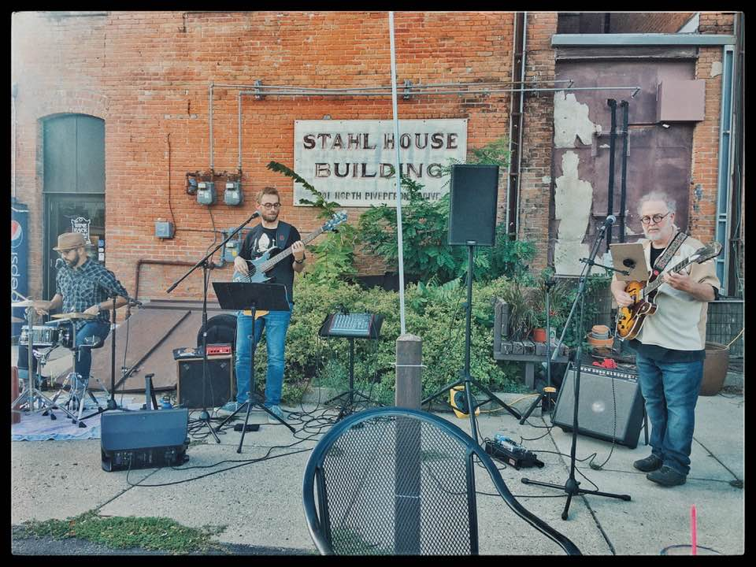

### The Donner Party
## A rockabilly experience like none other




## We'll be appearing at [Whit Wort Brewing](https://www.whitwortbrewing.com/) in Gibbon, MN from 7-9 pm on Thursday, September 8, 2022.

## Come see us at the [North Mankato Farmer's Market ](hhttps://www.northmankato.com/farmers-market) from 4-6 pm on Monday, September 12, 2022.

## We'll be appearing at [The Wine Cafe] (https://www.facebook.com/winecafe.bar) in Mankato, MN From 7-9 om on October 4, 2022.

=======
## See all upcoming events at [The Donner Party](https://www.facebook.com/thedonnerpartyrocks Facebook page)

### If you missed the livestream, you can still see [The Donner Party Christmas Party Party!](https://www.youtube.com/watch?v=iRwR2ySIA-g&t=1s)


# Contact us at <thedonnerpartyrocks@gmail.com>
# Logo by [Abby Daleki](www.abbydaleki.com>)
<!--
## Welcome to GitHub Pages

You can use the [editor on GitHub](https://github.com/thedonnerpartyrocks/thedonnerpartyrocks.github.io/edit/master/README.md) to maintain and preview the content for your website in Markdown files.

Whenever you commit to this repository, GitHub Pages will run [Jekyll](https://jekyllrb.com/) to rebuild the pages in your site, from the content in your Markdown files.

### Markdown

Markdown is a lightweight and easy-to-use syntax for styling your writing. It includes conventions for

```markdown
Syntax highlighted code block

# Header 1
## Header 2
### Header 3

- Bulleted
- List

1. Numbered
2. List

**Bold** and _Italic_ and `Code` text

[Link](url) and 
```

For more details see [GitHub Flavored Markdown](https://guides.github.com/features/mastering-markdown/).

### Jekyll Themes

Your Pages site will use the layout and styles from the Jekyll theme you have selected in your [repository settings](https://github.com/thedonnerpartyrocks/thedonnerpartyrocks.github.io/settings). The name of this theme is saved in the Jekyll `_config.yml` configuration file.

### Support or Contact

Having trouble with Pages? Check out our [documentation](https://help.github.com/categories/github-pages-basics/) or [contact support](https://github.com/contact) and we’ll help you sort it out.

-->
