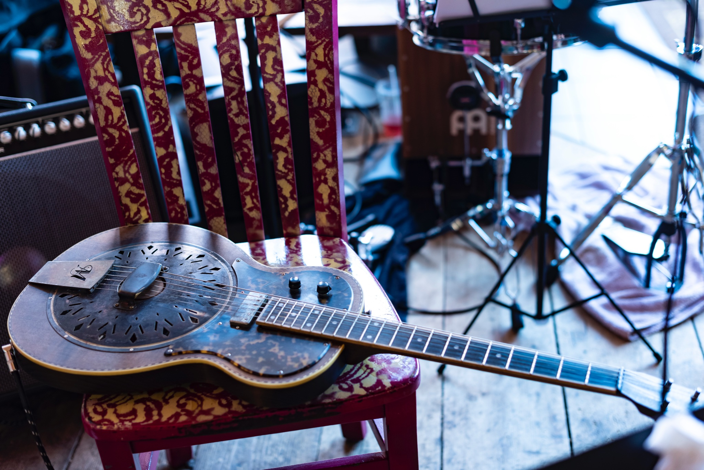

### The Donner Party
## A classic country experience like none other


<!--## We'll be appearing at [Whit Wort Brewing](https://www.whitwortbrewing.com/) in Gibbon, MN from 8-10 pm on Saturday, April 8, 2023.

## Great tunes and great drinks at [The Flame](https://www.facebook.com/theflamebarandgrill/) in St. Peter, MN from 7-10 pm on Saturday, April 22, 2023.

## Come see us with Angie Anderson at [The Coffee Hag](https://www.facebook.com/thecoffeehag) in Mankato, MN from 12-2 pm on Sunday, April 23, 2023.-->

## It's our third year at the [Waseca County Free Fair](https://www.wasecacountyfreefair.com/). We'll be playing the lunchtime show on Friday, July 14, 2023.

## We'll be backing up Angie Anderson as part of the [Minnesota Origial Music Festival](https://mnomf.org/). Check us out at [Patricks](https://patricksfood.com/) at 7pm on July 19th, right after the 48 hour band challenge draft.

## Get some fantastics beverages with us in the [Sweethaven Tonics](https://www.sweethaventonics.com/cocktail-lounge) cocktail lounge. We'll be there from 7-9pm on July 27 and August 31.

## Enjoy an evening lakeside at [Westwood Marina](https://www.westwoodmarina.com/). Our set will run from 6-9 pm on Saturday, July 29.

## Spend your Labor Day weekend with us at [Patrick's](https://patricksfood.com/) in Saint Peter, MN. We'll be your Sunday afternoon entertainment from 4-7 pm on Sunday, September 3rd.
=======
## See all upcoming events at [The Donner Party](https://www.facebook.com/thedonnerpartyrocks) Facebook page.

### If you missed the livestream, you can still see [The Donner Party Christmas Party Party!](https://www.youtube.com/watch?v=iRwR2ySIA-g&t=1s)


# Contact us at <thedonnerpartyrocks@gmail.com>
# Logo by [Abby Daleki](www.abbydaleki.com)
<!--
## Welcome to GitHub Pages

You can use the [editor on GitHub](https://github.com/thedonnerpartyrocks/thedonnerpartyrocks.github.io/edit/master/README.md) to maintain and preview the content for your website in Markdown files.

Whenever you commit to this repository, GitHub Pages will run [Jekyll](https://jekyllrb.com/) to rebuild the pages in your site, from the content in your Markdown files.

### Markdown

Markdown is a lightweight and easy-to-use syntax for styling your writing. It includes conventions for

```markdown
Syntax highlighted code block

# Header 1
## Header 2
### Header 3

- Bulleted
- List

1. Numbered
2. List

**Bold** and _Italic_ and `Code` text

[Link](url) and 
```

For more details see [GitHub Flavored Markdown](https://guides.github.com/features/mastering-markdown/).

### Jekyll Themes

Your Pages site will use the layout and styles from the Jekyll theme you have selected in your [repository settings](https://github.com/thedonnerpartyrocks/thedonnerpartyrocks.github.io/settings). The name of this theme is saved in the Jekyll `_config.yml` configuration file.

### Support or Contact

Having trouble with Pages? Check out our [documentation](https://help.github.com/categories/github-pages-basics/) or [contact support](https://github.com/contact) and we’ll help you sort it out.

-->
